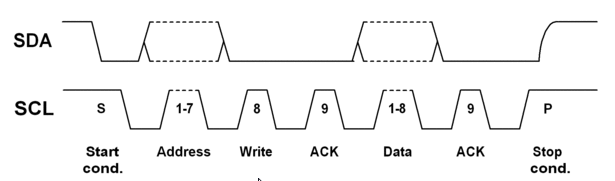
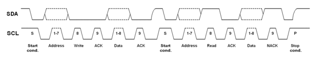

I2C
===

References
----------

[Wikipedia](https://en.wikipedia.org/wiki/I%C2%B2C)

[I2C Bus](https://www.i2c-bus.org/)

[Interrupt Memfault](https://interrupt.memfault.com/blog/i2c-in-a-nutshell)

Properties
-----------

- Acronym for: Inter Integrated Circuit
- Pronounciation: I-squared-C
- Synchronous
  - Clock transmitted via SCL
- Multi-Master
  - Reference ?
- Multi-Slave
  - GAC Smartcore: EEP + Amplifier
- Packet Switched
  - Every byte has a header
- Single Ended
  - All masters and slaves are connected to same reference / ground.
- Serial Communication
  - Data transmitted one bit at a time
- Open Drain / Non Return To Zero[NRZ]
  - By default the lines are pulled high by resistors and the lines can only be pulled low

Comparison
----------

Pros
----

- I2C has lesser number of pins than SPI
- I2C has a simpler physical layer than CAN as there is no differential signalling.

Cons
----

- CAN shall be used if reliablity is a must.
- UART can also be used if there is only one slave as it has the full duplex communication advantage.
- SPI shall be used if higher bandwidth is required (NOR Flash chips).
- MIPI shall be used if an even an higher bandwidth is required like in cameras and displays.

Notes
-----

- I2C bandwidths:
  - normal mode => 100kbit per second
  - fast mode => 400kbit per second
  - fast mode plus => 1Mbit per second
  - high speed mode => 3.4Mbits per second.
- I2C is made up of two pins: SCL (Serial clock) and SDA (Serial Data).
- The SCL clock is always generated by the respective I2C masters.
- I2C has a sawtooth curve because of the resistors that pull the line up.
- Arbitration:
  - All masters constantly observe the SCL and SDA for start and stop conditions. Every master will only start a transmission if the bus is idle (after a stop bit).
  - If two masters start a transfer at the same instant, one of them would stop their transmission if they observe a low instead of a high. This is extremely similar to the dominant bit in CAN transmission.
- As both lines can be pulled low by all parties in the bus, a slave can pull the clock line low to achieve "clock stretching" thereby gaining some time for processing.
- The I2C Protocol states that every byte of the payloads must be acknowledged by the receiver.
- Structure of a typical I2C Write Command:

- As seen in the above image, a START is signalled by pulling the SDA LOW with SCL HIGH. When SDA goes HIGH while SCL is HIGH, it is considered as a STOP signal.
- As seen in the above image, the address is 7 bits long. But even though this theoratically means 128 possible addresses, some of the addresses are reserved and thus only 112 addresses can be used.
- The reserved address are as follows:
  - 0 address followed by a write command is a General Call address i.e It Addresses all devices in the bus and shall typically be followed by a command of one byte. A good example would be a sw reset of all the connected devices. This is achieved by sending the address as 0b0000000(general call) followed by a 0b0(Write) followed by 0b00000110(06h).
- The Single bit after the 7 bit Slave Address is the READ/WRITE COMMAND. A 1 means the COMMAND is READ and a 0 means the COMMAND is WRITE.
- Structure of a typical I2C Read Command:

- As seen in the above image, a typical read will most likely be a write followed by a read. As the master has to continue holding the line after the write command, he signals a start again. This is called a repeated start condition.
