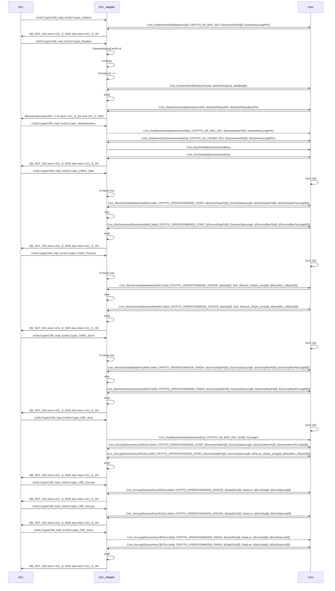

# Secure IPCL / Secure UCL

## Prerequisites

- RandomKeyID : This is the ID of the random key which shall be used to store the random seed in case of a PRNG.
- MasterKeyID : This is the ID of the master key.
- MasterKeyMACJobId : CMAC JobID using the MasterKeyID.
- SessionKeyIdMac : This is the ID of the session key for MAC.
- SessionKeyIdCip : This is the ID of the session key for Cip.
- SessionKeyMACJobId : CMAC JobID using the SessionKeyIdMac.
- SessionKeyCipJobId : Cip JobID using the SessionKeyIdCip.
- RandomJobID : JobID using the RandomKeyID

## Design

