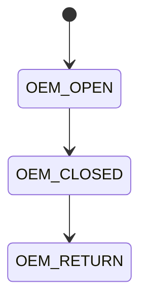

# KW45 Security

## Open questions for me

- Do we need to use trustzone for cortex m33 ?
- Clocking
- Powering

Dual image is supported with flash logical image feature.
Position Independent code.
Pimray (Latest and greatest), Secondary (fallback)

## ROM Boorloader

### Lifecycle states

## Booting

### Memories

- KW 45 ROM Boot reserves ROM  from 0x1480 0000 to 0x1481 8000
- KW 45 ROM Boot reserves STCM from 0x3000 0000 to 0x3000 4000

### ROM Bootloader paths

- Normal boot path with security and TrustZone Mode (TZ-M) option.
- In-system programming (ISP) path.
- Debugger mailbox path which supports debug authentication.
- Low power wakeup path.

fuses, boot configuration in user IFR, boot pin, debug request and low power
wakeup configuration.
