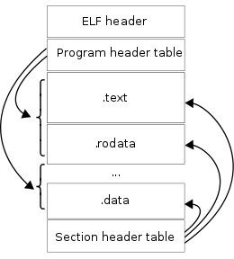
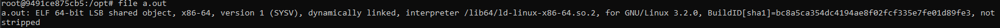
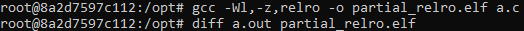
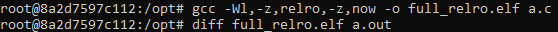

Hardening ELFs
==============

References
----------

- [Wikipedia](https://en.wikipedia.org/wiki/Executable_and_Linkable_Format)
- [ELF 101](https://www.intezer.com/blog/research/executable-linkable-format-101-part1-sections-segments/)
- [TrapKit](https://www.trapkit.de/)

Overview
--------

ELF stands for Executable Linkable Format.

The file extensions none, .axf, .bin, .elf, .o, .prx, .puff, .ko, .mod and .so, all stand for ELF files.

Before we dive into the various hardening techniques, we need to understand the anatomy of the ELF file.

An ELF File composes of three major components:

- ELF Header
- Sections
- Segments aka program headers

A high level layout of the ELF format is as follows:



As we have seen in the image above, an ELF has three major header(s) viz. The ELF Header, the program header(s) and the section header(s).

Before we start, lets have a compiled version which we can use as an example. The default output file of GCC is an ELF historically.

Please note the following example was compiled with gcc (Ubuntu 7.5.0-3ubuntu1~18.04) 7.5.0

```c
#include <stdio.h>
int main()
{
    printf(Hello!\n);
    return 0;
}
```

```gcc a.c```



- ELF Header
  - The ELF Header contains information about the binary.
  - The ELF Header can be displayed with the help of ```readelf -h <binary>```

- Sections
  - Sections consist of all information needed to link the target object file (binary) in order to build a working library.
  - Every section will have a section header.
  - The ELF Sections can be read using ```readelf -S <executable>```
  - Some interesting common sections are:
    - .text:code
    - .data: intialised data
    - .rodata: initialised read only data
    - .bss: uninitialised data
    - .plt: Procedure Linkage Table(also called as IAT - Import address Table)
    - .got: Global Offset Table(GOT) entries dedicated to dynamically linked global variables.
    - .got.pls: GOT entries dedicated to dynamically linked functions (this is interchangably also called .plt.got)
    - .symtab: Global synbol table
    - .dynamic: Holds all information needed for dynamic linking
    - .rel.dyn: global variable relocation table
    - .rel.plt: function relocation table.

> Note: Sections are needed at linktime but not at runtime.

- Segments
  - Segments aka Program Headers break down an ELF so that it can be loaded into memory.
  - Segments are not needed in linktime.
  - Segments can be read by using the command ```readelf -l <executable>```

RELRO
-----

Note: Recent linux distributions have "full RELRO" enabled by default.

Read-only relocations (RELRO) allow sections of an executable that need to be writable only while a program is loading to be marked read-only before the program starts. This when used independantly without BIND_NOW is often reffered to as "partial RELRO".

To enable partial RELRO, the binary can be compiled with ```gcc -Wl,-z,relro -o <binary_name> <source_code>```

There will be no difference between "gcc a.c" and "gcc -Wl,-z,relro a.c" (As Full RELRO is already enabled).



- We can find that the ELF internal data sections (.got, .dtors, etc.) precede the program's data sections (.data and .bss).
- Non-PLT GOT is read-only
- GOT is still writeable

BIND_NOW [FULL RELRO]
---------------------

Note: Recent linux distributions have "full RELRO" enabled by default.

Full RERLO or BIND_NOW has all the features of Partial RELRO but also has the entire GOT (re)mapped as read-only.

To enable partial RELRO, the binary can be compiled with ```gcc -Wl,-z,relro,-z,now -o <binary_name> <source_code>```

There will be no difference between "gcc a.c" and "gcc -Wl,-z,relro,-z,now a.c" (As Full RELRO is already enabled).



Vulnerablities
--------------

- [FFMPEG RELRO TRAPKIT](http://www.trapkit.de/advisories/TKADV2009-004.txt)
